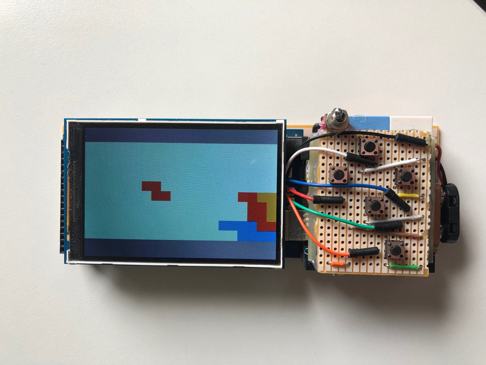

# Game_Console_With_Arduino

This is a small game console I built with an Arduino.
It has a 3.5" screen, an Arduino Mega 2560, a 9v battery connected to the Arduino which is controlled by a switch,
and it has buttons that I soldered onto a pcb board and then ran wires to the GPIO pins on the Arduino.

I programmed Tetris for the Arduino and this screen using C++,
The board is just a 2 dimensional array and the rest is pretty simple.
The most complicated thing in the code was using linear transformations for the rotation of the block in the array.
I also used interupts for detecting when a button is pressed because the Arduino has no multithreading.
